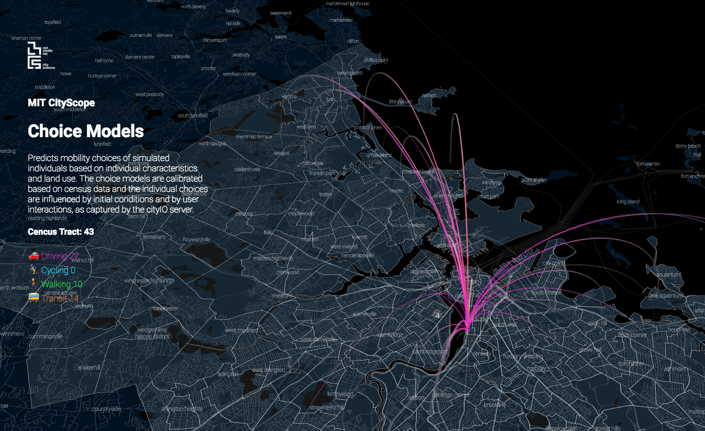

# Mobility Choice API for CityScope Platform
Predicts mobility choices of simulated individuals based on individual characteristics and land use. The choice models are calibrated based on census data and the individual choices are influenced by initial conditions and by user interactions, as captured by the cityIO server.

## Overview

This repo contains 3 main components:

### 1. Data Analysis and Model Calibration
A number of scripts are provided for analyzing data from sources including the US census, OpenStreetMap and OpenTripPlanner in order to develop a base population sample and to calibrate a multinomial logit model for mode choice prediction.

### 2. API
The mobilityApi.py script is an API based on a python Flask server. The server combines the analysis results, calibrated model and real-time updates from the cityIO server to make mode choice predictions for every individual in the population sample and simulate new individuals when appropriate. 

The API has three routes for the geojson, the O-D matrix and the agent data. 

# [Geojson](https://cityio.media.mit.edu/choiceModels/volpe/v1.0/geo)
The geojson is static and should be retrieved only once by the client.

# [Modal O-D Matrix](https://cityio.media.mit.edu/choiceModels/volpe/v1.0/od)
The O-D data update every time the cityIO grid changes. The structure of the O-D data is as follows. The top level is a list with an entry for each origin zone 'o'. The zone numbers correspond to the order of the features in the geojson. The entry for each origin is a list of arcs with a destination, a mode and an estimated number of people.

[
[{"o":0,"d":4,"m":0,"P":1.61},{"o":0,"d":4,"m":1,"P":0.72}],
[{"o":1,"d":3,"m":0,"P":1.2},{"o":1,"d":7,"m":2,"P":0.72}, ,{"o":1,"d":8,"m":3,"P":1.5}]
...
]

where 'o' is the origin zone, 'd' is the destnation zone, 'm' is the mode where:

| 0       | 1       | 2       | 3       |
|---------|---------|---------|---------|
| driving | cycling | walking | transit |

'P' is the estimated number of people.

# [Agents](https://cityio.media.mit.edu/choiceModels/volpe/v1.0/agents)
The agents data update every time the cityIO grid changes. The structure is a list of agent groups with the same characteristics.

[{"o":0,"d":4,"a":1,"m":0,"P":1},{"o":0,"d":4,"a":2,"m":0,"P":1},{"o":0,"d":6,"a":0,"m":0,"P":1}...]

where 'o' is the origin zone, 'd' is the destnation zone, 'a' is the age group where 0-2 correspond to youngest, middle and eldest, m' is the mode where 0-3 correspond to 'driving', 'cycling', 'walking' and 'PT', and 'P' is the estimated number of people.

### 3. Front End

